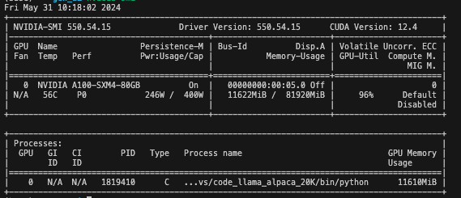
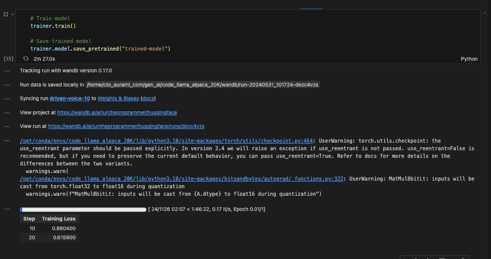
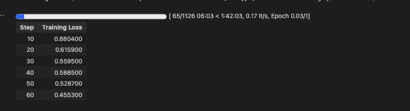
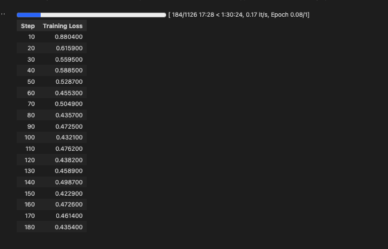

# CODE LLAMA TRAINING

GPU TYPE: A100 80GB
VRAM USED: 11.6GB

Training Dataset: HuggingFaceH4/CodeAlpaca_20K
Dataset Link: https://huggingface.co/datasets/HuggingFaceH4/CodeAlpaca_20K
Dataset Size: 20K rows (train: 18K, test: 2K)

Pretrained Model: codellama/CodeLlama-7b-hf
Pretrained Model Link: codellama/CodeLlama-7b-hf

Finetuning Training Time: 1 hour 47 mins

HF Uploaded Model:
HF Uploaded Tokenizer:
Wandb Logs Link:

## DATASET EXAMPLE

Prompt: `Use a loop in Java to print out the squares of numbers from 1 to 10.`

Completion: `for (int i = 1; i <= 10; i++) { System.out.println(i * i); }`

## TRAINING LOGS

---